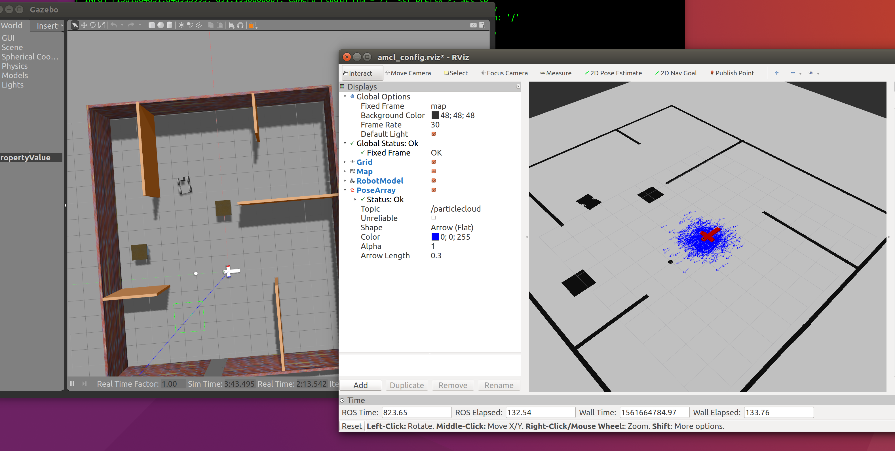

# Udacity Robotics Nanodegree
# Project #3: Where Am I?



## Introduction
This is a project for Udacity's Robotics NanoDegree. It's a robot that uses a Hokuyo laser scanner and Monte Carlo Localization to localize itself inside a simulated environment.


## Getting Started


 run:
```
$ catkin_make
$ source devel/setup.bash
$ roslaunch my_robot world.launch
```

From RVIZ GUI open the amcl_config.rviz file from rviz folder. 